# JAVASCRIPT DASAR
- [JAVASCRIPT DASAR](#javascript-dasar)
  - [RECURSIVE](#recursive)
    - [RECURSIVE](#recursive-1)
    - [RECURSIVE DENGAN BASELINE](#recursive-dengan-baseline)
    - [FUNGSI FAKTORIAL MENGGUNAKAN RECURSIVE](#fungsi-faktorial-menggunakan-recursive)
    - [KEGUNAAN RECURSIVE](#kegunaan-recursive)
  - [FUNCTION DECLARATION VS FUNCTION EXPRESSION](#function-declaration-vs-function-expression)
    - [Penulisan Function Declaration :](#penulisan-function-declaration-)
    - [Penulisan Function Expression :](#penulisan-function-expression-)
    - [PERBEDAAN FUNCTION EXPRESSION DAN DECLARATION](#perbedaan-function-expression-dan-declaration)
  - [ARRAY](#array)
    - [KENAPA PAKAI ARRAY ?](#kenapa-pakai-array-)
    - [MEMBUAT ARRAY](#membuat-array)
    - [MENAMPILKAN ISI ARRAY](#menampilkan-isi-array)
    - [ARRAY ADALAH OBJECT](#array-adalah-object)
    - [ARRAY BISA DIISI FUNGSI DAN ARRAY LAIN](#array-bisa-diisi-fungsi-dan-array-lain)
    - [JADI ARRAY ADALAH](#jadi-array-adalah)
    - [MANIPULASI ARRAY](#manipulasi-array)
      - [MENAMBAH ISI ARRAY](#menambah-isi-array)
      - [MENGHAPUS ISI ARRAY](#menghapus-isi-array)
      - [MENAMPILKAN ARRAY](#menampilkan-array)
      - [METHOD : JOIN](#method--join)
      - [METHOD : PUSH](#method--push)
      - [METHOD : POP](#method--pop)
      - [METHOD UNSHIFT DAN SHIFT](#method-unshift-dan-shift)
      - [METHOD: SPLICE](#method-splice)
      - [METHOD: SLICE](#method-slice)
      - [METHOD : FOREACH dan MAP dan SORT](#method--foreach-dan-map-dan-sort)
      - [METHOD : FOREACH](#method--foreach)
      - [METHOD : MAP](#method--map)
      - [METHOD : SORT](#method--sort)
      - [METHOD : FILTER](#method--filter)
      - [METHOD : FIND](#method--find)

## RECURSIVE

Merupakan Fungsi yang memanggil dirinya sendiri. Sebenarnya kita bisa memanfaatkan for untuk looping

```js
for (var i = 10; i >= 1; i--) {
  console.log(i);
}
```

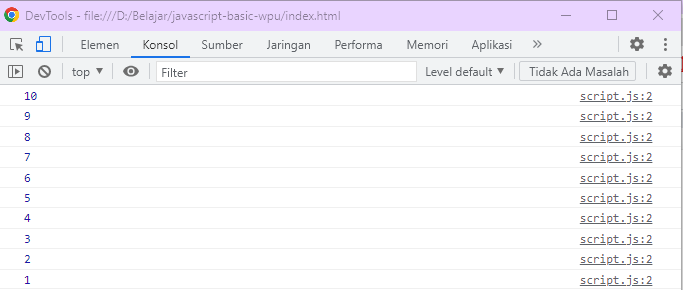

### RECURSIVE 

Namun kita bisa juga membuat looping menggunakan **recursive**

```js
function tampilAngka(n) {
  console.log(n);
  return tampilAngka(n - 1);
}

tampilAngka(10);
```

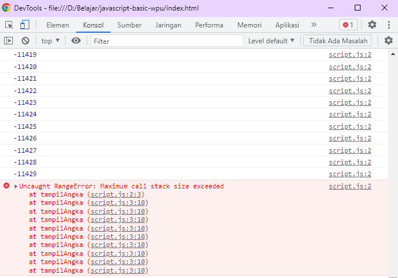

### RECURSIVE DENGAN BASELINE

dari contoh sebelumnya fungsi akan berjalan tanpa henti sehingga harus ada kondisi berhenti, kondisi ini di sebut Base Case.

```js
function tampilAngka(n) {
  //  ini merupakan contoh base case
  if (n === 0) {
    return;
  }
  console.log(n);
  return tampilAngka(n - 1);
}

tampilAngka(10);
```

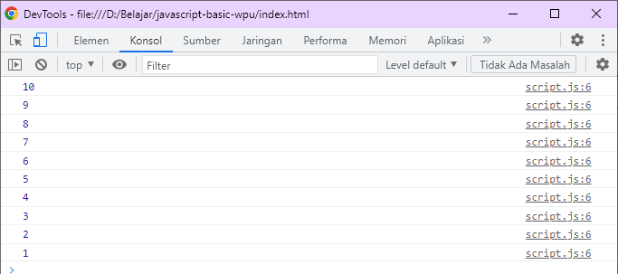

### FUNGSI FAKTORIAL MENGGUNAKAN RECURSIVE

```js
function faktorial(n) {
  if (n === 0) return 1;
  return n * faktorial(n - 1);
}

console.log(faktorial(5));
```

 berikut adalah proses yang dilakukan fungsi faktorial di atas
 * faktorial (5)
 * 5 * faktorial (4)
 * 5 * (4 * faktorial (3))
 * 5 * (4 * (3 * faktorial (2))
 * 5 * (4 *(3 * (2 * faktorial (1))))
 * 5 * (4 * (3 * (2 * 1)))
 * 5 * (4 * (3 * 2))
 * 5 * (4 * 6)
 * 5 * 24
 * 120

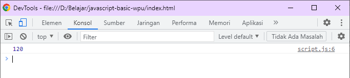

>Semua Looping bisa dibuat recursive tapi tidak sebaliknya

### KEGUNAAN RECURSIVE

1. Menggantikan looping
2. Fibonancci
3. Pencarian dan penelurusan pada struktur data list dan tree
4. untuk bahasa pemograman yang tidak memiliki pengulangan

## FUNCTION DECLARATION VS FUNCTION EXPRESSION

### Penulisan Function Declaration :

>function identifier (ParameterList <sub>opt</sub>) {FunctionBody}

```js
function tampilPesanDec(nama) {
  alert("halo" + nama);
}
```

### Penulisan Function Expression : 

>function identifier <sub>opt</sub> (ParameterList <sub>opt</sub>) {FunctionBody}

```js
function tampilPesanExp(nama) {
  alert("halo" + nama);
}
//atau
function (nama) {
    alert("halo" + nama);
  }
```

namun penulisan Function Expression di atas baru bisa dikatakan function expression ketika disimpan di dalam sebuah expresi

```js
var tampilPesanExp = function (nama) {
    alert("halo" + nama);
  }
```

### PERBEDAAN FUNCTION EXPRESSION DAN DECLARATION

| FUNCTION DECLARATION | FUNCTION EXPRESSION |
| ------ | ------- |
| lebih fleksibel, karena bisa tulis dimanapun, bisa ditulis sebelum atau sesudah pemanggilan function. ini terjadi karena di dalam javascript ada konsep yang namanya HOISTING yaitu deklarasi sebuah function pasti disimpan terlebih dahulu di dalam memory.   |  Harus didefinisikan dulu sebelum dipanggil|
| cenderung lebih mudah dipahami pemula|lebih powerful, kita bisa membuat function expression sebagai closure, atau sebagai argumen untuk function lain.|
| | bisa dibuat sebagai IIFE (Immediately Invoked Function Expression) |

## ARRAY

array ada banyak di bahasa lain, walaupun konsep nya berbeda (ada yang menjadikan sebagai tipe data ada yang menjadikan jadi struktur data)

wikipedia : array adalah tipe data yang digunakan untuk mendeskripsikan kumpulan element (nilai atau variabel) yang tiap tiap elemennya memiliki index

wpu : array adalah variabel yang lebih sakti karena bisa menampung lebih dari satu nilai

jika menggunakan variabel kita hanya bisa menyimpan 1 nilai

```js
var hari = "senin";
var hari = "selasa"; // variabel hari akan diganti nilai nya jadi selasa
```

sedangkan dengan array kita bisa menyimpan lebih dari 1 nilai 

```js
var hari = ["senin", "selasa"];
```

### KENAPA PAKAI ARRAY ?
* untuk mempermudah pengelolaa nilai / value /data dalam penelusuran dan pencarian
* manajemen memori

### MEMBUAT ARRAY

```js
var binatang = [];
binatang = ["kucing", "anjing"];
```

### MENAMPILKAN ISI ARRAY

```js
console.log(binatang[1]);
```

### ARRAY ADALAH OBJECT

```js
console.log(typeof binatang);
```

### ARRAY BISA DIISI FUNGSI DAN ARRAY LAIN

```js
var myFunc = function () {
  alert("Hello World");
};

var myArr = ["teks", 2, false, myFunc, [4, 5, 6]];
```

### JADI ARRAY ADALAH

* variabel jamak yg punya banyak elemen dan diacu dengan nama yang sama
* kumpulan pasangan key dan nilai
* key adalah index dengan tipe integer dimulai dari 0
* array pada javascript tipenya adalah OBJECT
* Array pada javascript memiliki fungsi / method length untuk menghitung jumlah elemen dan ada method lainnya juga
* Elemen pada Array boleh memiliki tipe data yang berbeda

### MANIPULASI ARRAY

#### MENAMBAH ISI ARRAY

```js
var arr = [];
arr[0] = "Aung";
arr[1] = "La";
//tapi hati hati, jika menggunakan cara ini, kita harus apal urutannya
jika kita tambahakan
arr[3] = "Nsang";
//maka index ke-2 akan diisi undefined

console.log(arr); //maka akan tampil dalam bentuk object
```

#### MENGHAPUS ISI ARRAY

```js
var arr = ["Aung", "La", "Nsang"];
arr[1] = undefined;
console.log(arr);
```

#### MENAMPILKAN ARRAY

```js
var arr = ["Aung", "La", "Nsang"];

for (var i = 0; i < arr.length; i++) {
  console.log("Mahasiswa ke-" + (i + 1) + arr[i]);
}
```

#### METHOD : JOIN
method join, menggabungkan isi array dan mengubah menjadi string

```js
var arr = ["Aung", "La", "Nsang"];
console.log(arr.join());
console.log(arr.join("-"));
```

#### METHOD : PUSH
digunakan untuk menambah element array di akhir array(push);

```js
var arr = ["Aung", "La", "Nsang"];
arr.push("Doddy","steven","senna");
console.log(arr.join());
```

#### METHOD : POP
digunakan untuk menghilangkan element terakhir dari sebuah array

```js
arr.pop();
console.log(arr.join("=="));
```

#### METHOD UNSHIFT DAN SHIFT
sama seperti POP dan PUSH hanya saja dia bekerja di awal array

```js
arr.unshift("mark", "jugenberg");
console.log(arr.join("-"));

arr.shift();
console.log(arr.join("="));
```

#### METHOD: SPLICE
digunakan untuk menyisipkan elemen
>splice(indexAwal, mauDiHapusBerapa, Elemenbaru1, Elemenbaru2)

```js
var arr = ["Aung", "La", "Nsang"];
arr.splice(1, 0, "Vitaly", "Bigdash");
console.log(arr.join(","));
```

#### METHOD: SLICE
digunakan untuk mengambil beberapa bagian array untuk menjadi bagian baru
>slice(indexawal,indexakhir)

>index awal akan terbawa ke index yang baru, index yang terakhir tidak

```js
var arr2 = ["Aung", "La", "Nsang", "Luis", "Suarez", "Messi"];
// misal saya ingin mengambil Luis dan Suarez
// The slice() method does not change the original array.
var newarr2 = arr2.slice(3, 5);
console.log(newarr2.join("-"));
```

#### METHOD : FOREACH dan MAP dan SORT

Dua method pada "object array" di Javascript. secara umum penggunaannya sama dengan for, tapi dengan kedua method ini kita bisa melakukan sesuatu pada elemen-elemen yang ada dalam array.

#### METHOD : FOREACH

Misalkan kita memiiki array angka

```js
var angka = [1,2,3,4,5,6,7,8]
```

kalau menggunakan **for** 

```js
for (var i = 0; i< angka.length; i++) {
    console.log(angka[i]);
}
```

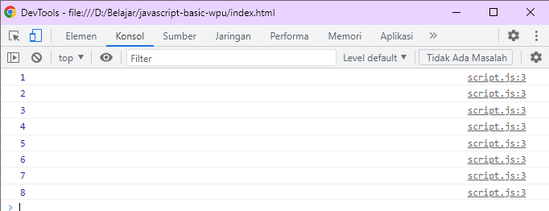

sekarang kita coba menggunakan **forEach** dengan function expression

```js
var cetak = function (e) {
  console.log(e);
};

angka.forEach(cetak);
```

atau simpelnya
```js

angka.forEach(function (e) {
  console.log(e);
});

```
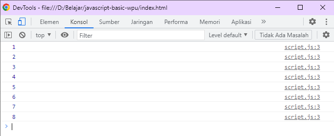

menggunakan function expression pada **foreach** selain kita bisa memainkan elemen kita bisa juga memainkan indexnya

```js
var nama = ["Gema", "Aidan", "Ramadhana"];
nama.forEach(function (element, index) {
  console.log("Orang ke " + (index + 1) + " adalah " + element);
});
```
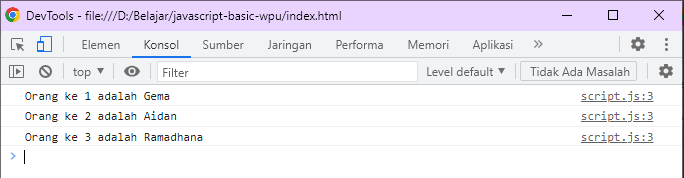

#### METHOD : MAP

map sama seperti foreach. Tapi map **mengembalikan** array sedangkan foreach **tidak**.

```js
var angka = [1, 5, 3, 8, 6, 2];
var angka2 = angka.map(function (e) {
  return e * 2;
});

console.log(angka2);
console.log(angka2.join("-"));
```
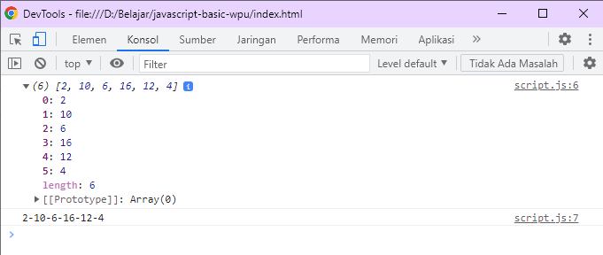

#### METHOD : SORT

method sort digunakan untuk mengurutkan isi array, mengembalikan array juga

```js
var angka = [1, 5, 3, 4, 2, 6, 7, 8];
console.log(angka.join("-"));

angka.sort(); //method short sifat nya menimpa isi sebelumnya
console.log(angka.join(","));
```

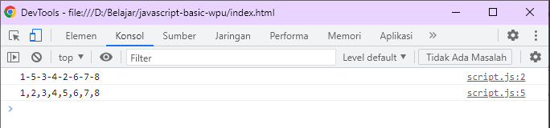

sort mengurutkan karakter pertamanya dulu

```js
var angka = [1, 5, 3, 4, 2, 6, 7, 8, 10, 20];

angka.sort(); 
console.log(angka.join(","));
```

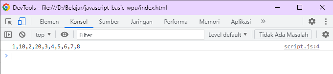

sehingga harus menggunakan function perbandingan angka

```js
var angka = [1, 5, 3, 4, 2, 6, 7, 8, 10, 20];

angka.sort(function (a, b) {
  return a - b;
});

console.log(angka.join(","));
```

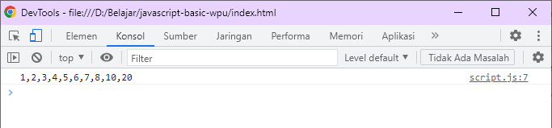

#### METHOD : FILTER

berfungsi mencari nilai pada array dan mengembalikannya dalam bentuk array. 

```js
var angka = [1, 5, 3, 4, 2, 6, 7, 8, 10, 20];
//kita tampung di variabel baru, karena filter tidak mengoverwrite isi. 
var angka2 = angka.filter(function (x) {
  return x > 7;
});

console.log(angka2);
console.log(angka2.join("-"));
```

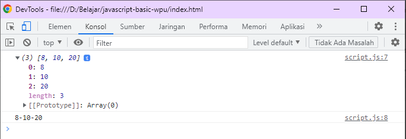

#### METHOD : FIND
mengembalikan satu nilai (tidak menghasilkan array) yang pertama ditemukan

```js
var angka = [1, 5, 3, 4, 2, 6, 7, 9, 8, 10, 20];
//kita tampung di variabel baru, karena filter tidak mengoverwrite isi.
var angka2 = angka.find(function (x) {
  return x > 7;
});

console.log(angka2);
```
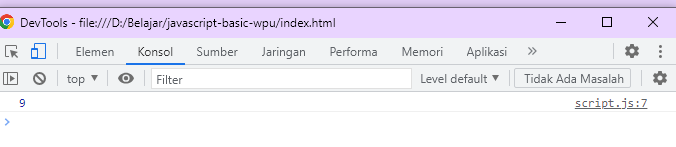

