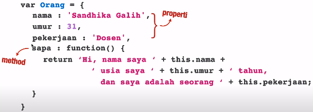
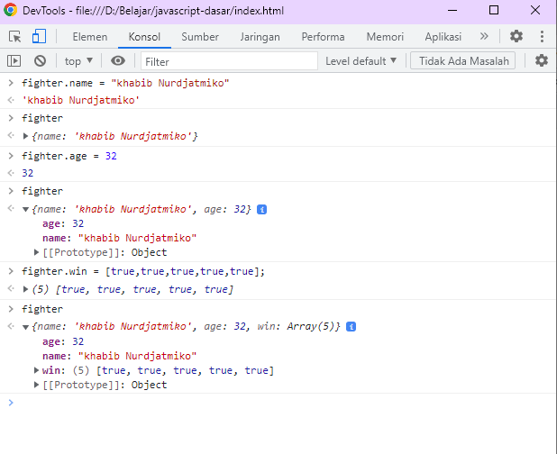
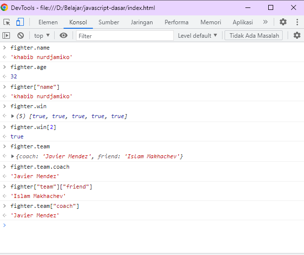
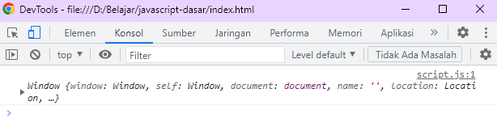
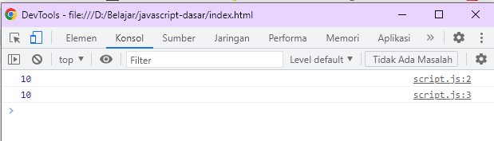
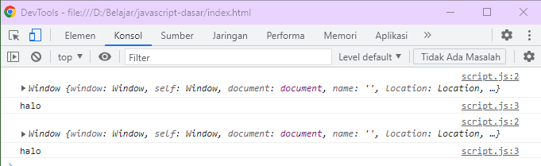
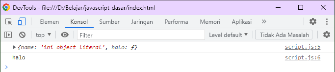
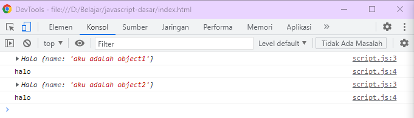

# **JAVASCRIPT DASAR**
- [**JAVASCRIPT DASAR**](#javascript-dasar)
  - [**RECURSIVE**](#recursive)
    - [RECURSIVE](#recursive-1)
    - [RECURSIVE DENGAN BASELINE](#recursive-dengan-baseline)
    - [FUNGSI FAKTORIAL MENGGUNAKAN RECURSIVE](#fungsi-faktorial-menggunakan-recursive)
    - [APA KEGUNAAN RECURSIVE ?](#apa-kegunaan-recursive-)
  - [**FUNCTION DECLARATION DAN FUNCTION EXPRESSION**](#function-declaration-dan-function-expression)
    - [PENULISAN FUNCTION DECLARATION](#penulisan-function-declaration)
    - [PENULISAN FUNCTION EXPRESSION](#penulisan-function-expression)
    - [**PERBEDAAN FUNCTION EXPRESSION DAN FUNCTION DECLARATION**](#perbedaan-function-expression-dan-function-declaration)
  - [**ARRAY**](#array)
    - [**KENAPA MENGGUNAKAN ARRAY ?**](#kenapa-menggunakan-array-)
    - [**MEMBUAT ARRAY**](#membuat-array)
    - [**MENAMPILKAN ISI ARRAY**](#menampilkan-isi-array)
    - [**ARRAY ADALAH OBJECT**](#array-adalah-object)
    - [**ARRAY BISA DIISI DENGAN FUNGSI DAN ARRAY LAIN**](#array-bisa-diisi-dengan-fungsi-dan-array-lain)
    - [**JADI ARRAY ADALAH**](#jadi-array-adalah)
    - [**MANIPULASI ARRAY**](#manipulasi-array)
      - [**MENAMBAH ISI ARRAY**](#menambah-isi-array)
      - [**MENGHAPUS ISI ARRAY**](#menghapus-isi-array)
      - [**MENAMPILKAN ARRAY**](#menampilkan-array)
      - [**METHOD : JOIN**](#method--join)
      - [**METHOD : PUSH**](#method--push)
      - [**METHOD : POP**](#method--pop)
      - [**METHOD UNSHIFT DAN SHIFT**](#method-unshift-dan-shift)
      - [**METHOD: SPLICE**](#method-splice)
      - [**METHOD: SLICE**](#method-slice)
      - [METHOD : FOREACH dan MAP dan SORT](#method--foreach-dan-map-dan-sort)
      - [METHOD : FOREACH](#method--foreach)
      - [METHOD : MAP](#method--map)
      - [METHOD : SORT](#method--sort)
      - [METHOD : FILTER](#method--filter)
      - [METHOD : FIND](#method--find)
    - [LATIHAN ARRAY](#latihan-array)
  - [OBJECT](#object)
    - [KENAPA KITA MENGGUNAKAN OBJECT ?](#kenapa-kita-menggunakan-object-)
    - [ANATOMI OBJECT](#anatomi-object)
    - [PENGANTAR TENTANG OBJECT](#pengantar-tentang-object)
    - [MEMBUAT OBJECT](#membuat-object)
      - [**Literal**](#literal)
      - [**Function Declaration**](#function-declaration)
      - [**Constructor Function (keyword new)**](#constructor-function-keyword-new)
      - [**Object.create()**](#objectcreate)
    - [**KONSEP THIS**](#konsep-this)
    - [**KONSEP THIS PADA 3 CARA PEMBUATAN OBJECT**](#konsep-this-pada-3-cara-pembuatan-object)
      - [**THIS PADA FUNCTION DECLARATION**](#this-pada-function-declaration)
      - [**THIS PADA OBJECT LITERAL**](#this-pada-object-literal)
      - [**THIS PADA CONSTRUCTOR**](#this-pada-constructor)

## **RECURSIVE**

**Recursive** merupakan fungsi yang memanggil dirinya sendiri. Sebenarnya kita bisa memanfaatkan *for* untuk melakukan *looping*.

```js
for (var i = 10; i >= 1; i--) {
  console.log(i);
}
```


### RECURSIVE 

Untuk mendapatkan *output* yang sama seperti contoh sebelumnya, bisa juga menggunakan **Recursive**

```js
function tampilAngka(n) {
  console.log(n);
  return tampilAngka(n - 1);
}

tampilAngka(10);
```


### RECURSIVE DENGAN BASELINE

Dari contoh sebelumnya fungsi **Recursive** akan berjalan tanpa henti, sehingga harus ada suatu kondisi yang membuat *looping* berhenti, kondisi ini di sebut *Base* *Case*.

```js
function tampilAngka(n) {
  //  ini merupakan contoh base case
  if (n === 0) {
    return;
  }

  console.log(n);
  return tampilAngka(n - 1);
}

tampilAngka(10);
```


### FUNGSI FAKTORIAL MENGGUNAKAN RECURSIVE

**Recursive** biasa digunakan untuk membuat fungsi faktorial

```js
function faktorial(n) {
  if (n === 0) return 1;
  return n * faktorial(n - 1);
}

console.log(faktorial(5));
```

 berikut penjelasan fungsi **Recursive** faktorial di atas
 * faktorial (5)
 * 5 * faktorial (4)
 * 5 * (4 * faktorial (3))
 * 5 * (4 * (3 * faktorial (2))
 * 5 * (4 *(3 * (2 * faktorial (1))))
 * 5 * (4 * (3 * (2 * 1)))
 * 5 * (4 * (3 * 2))
 * 5 * (4 * 6)
 * 5 * 24
 * 120


>Semua *looping* bisa dibuat **Recursive** tapi tidak sebaliknya.

### APA KEGUNAAN RECURSIVE ?

1. Menggantikan *looping*
2. Fibonancci
3. Pencarian dan penelurusan pada struktur data *list* dan *tree*
4. untuk bahasa pemograman yang tidak memiliki pengulangan

## **FUNCTION DECLARATION DAN FUNCTION EXPRESSION**

Di dalam *javascript* terdapat dua cara pembuatan fungsi yaitu 

1) **Function** **Declaration**
2) **Function** **Expression**
   
### PENULISAN FUNCTION DECLARATION 

>*function* *identifier* (*ParameterList* <sub>*opt*</sub>) {*FunctionBody*}

```js
function tampilPesanDec(nama) {
  alert("halo" + nama);
}
```

### PENULISAN FUNCTION EXPRESSION 

>*function* *identifier* <sub>*opt*</sub> (*ParameterList* <sub>*opt*</sub>) {*FunctionBody*}

```js
function tampilPesanExp(nama) {
  alert("halo" + nama);
}
//atau
function (nama) {
    alert("halo" + nama);
  }
```

Penulisan **Function** **Expression** di atas baru bisa dikatakan sebagai **Function Expression** ketika disimpan di dalam sebuah ekpresi, seperti pada contoh berikut

```js
var tampilPesanExp = function (nama) {
    alert("halo" + nama);
  }
```

### **PERBEDAAN FUNCTION EXPRESSION DAN FUNCTION DECLARATION**

| FUNCTION DECLARATION | FUNCTION EXPRESSION |
| ------ | ------- |
| Lebih fleksibel, karena bisa tulis dimanapun, bisa ditulis sebelum atau sesudah pemanggilan fungsi. ini terjadi karena di dalam javascript ada konsep yang disebut *Hoisting* yaitu deklarasi sebuah fungsi pasti disimpan terlebih dahulu di dalam memori.   |  Harus didefinisikan dulu sebelum dipanggil|
| Cenderung lebih mudah dipahami pemula|lebih *powerful*, kita bisa membuat **Function Expression** sebagai *closure*, atau sebagai argumen untuk fungsi lain.|
| | bisa dibuat sebagai IIFE (*Immediately* *Invoked* *Function* *Expression*) |

## **ARRAY**

**Array** terdapat juga di bahasa lain, walaupun konsep nya berbeda (ada yang menjadikan **array** sebagai tipe data ada yang menjadikan **array** sebagai struktur data).

Menurut wikipedia **array** adalah tipe data yang digunakan untuk mendeskripsikan kumpulan elemen (nilai atau variabel) yang tiap tiap elemennya memiliki *index*.

Menurut Pak Sandhika **array** adalah variabel yang lebih sakti karena bisa menampung lebih dari satu nilai.

jika menggunakan variabel kita hanya bisa menyimpan 1 nilai

```js
var hari = "senin";
var hari = "selasa"; // variabel hari akan diganti nilai nya jadi selasa
```

sedangkan dengan **array** kita bisa menyimpan nilai lebih dari 1 nilai 

```js
var hari = ["senin", "selasa"];
```

### **KENAPA MENGGUNAKAN ARRAY ?**
* Untuk mempermudah pengelolaan nilai / *value* /data dalam penelusuran dan pencarian
* manajemen memori

### **MEMBUAT ARRAY**

```js
var binatang = [];
binatang = ["kucing", "anjing"];
```

### **MENAMPILKAN ISI ARRAY**

```js
console.log(binatang[1]);
```

### **ARRAY ADALAH OBJECT**

```js
console.log(typeof binatang);
```

### **ARRAY BISA DIISI DENGAN FUNGSI DAN ARRAY LAIN**

```js
var myFunc = function () {
  alert("Hello World");
};

var myArr = ["teks", 2, false, myFunc, [4, 5, 6]];
```

### **JADI ARRAY ADALAH**

* Variabel jamak yg punya banyak elemen dan diacu dengan nama yang sama
* Kumpulan pasangan *key* dan *value*
* *Key* adalah *index* dengan tipe integer yang dimulai dari 0
* **Array** pada javascript tipenya adalah *Object*
* **Array** pada javascript memiliki fungsi / *method* *length* untuk menghitung jumlah elemen dan juga memiliki *method* yang lain
* Elemen pada **array** boleh memiliki tipe data yang berbeda

### **MANIPULASI ARRAY**

#### **MENAMBAH ISI ARRAY**

```js
var arr = [];
arr[0] = "Aung";
arr[1] = "La";
//tapi hati hati, jika menggunakan cara ini, kita harus apal urutannya
jika kita tambahakan
arr[3] = "Nsang";
//maka index ke-2 akan diisi undefined

console.log(arr); //maka akan tampil dalam bentuk object
```

#### **MENGHAPUS ISI ARRAY**

```js
var arr = ["Aung", "La", "Nsang"];
arr[1] = undefined;
console.log(arr);
```

#### **MENAMPILKAN ARRAY**

```js
var arr = ["Aung", "La", "Nsang"];

for (var i = 0; i < arr.length; i++) {
  console.log("Mahasiswa ke-" + (i + 1) + arr[i]);
}
```

#### **METHOD : JOIN**
*method* *join*, menggabungkan isi **array** dan mengubah menjadi *string*

```js
var arr = ["Aung", "La", "Nsang"];
console.log(arr.join());
console.log(arr.join("-"));
```

#### **METHOD : PUSH**
*Push* digunakan untuk menambah elemen **array** di akhir **array**;

```js
var arr = ["Aung", "La", "Nsang"];
arr.push("Doddy","steven","senna");
console.log(arr.join());
```

#### **METHOD : POP**
*POP* digunakan untuk menghilangkan elemen terakhir dari sebuah **array**

```js
arr.pop();
console.log(arr.join("=="));
```

#### **METHOD UNSHIFT DAN SHIFT**
*Method* ini sama seperti *Pop* dan *Push*, hanya saja dia bekerja di awal **array**

```js
arr.unshift("mark", "jugenberg");
console.log(arr.join("-"));

arr.shift();
console.log(arr.join("="));
```

#### **METHOD: SPLICE**
*Splice* digunakan untuk menyisipkan elemen
>*splice*(*indexAwal*, *mauDiHapusBerapa*, *Elemenbaru1*, *Elemenbaru2*)

```js
var arr = ["Aung", "La", "Nsang"];
arr.splice(1, 0, "Vitaly", "Bigdash");
console.log(arr.join(","));
```

#### **METHOD: SLICE**
digunakan untuk mengambil beberapa bagian array untuk menjadi bagian baru
>slice(indexawal,indexakhir)

>index awal akan terbawa ke index yang baru, index yang terakhir tidak

```js
var arr2 = ["Aung", "La", "Nsang", "Luis", "Suarez", "Messi"];
// misal saya ingin mengambil Luis dan Suarez
// The slice() method does not change the original array.
var newarr2 = arr2.slice(3, 5);
console.log(newarr2.join("-"));
```

#### METHOD : FOREACH dan MAP dan SORT

Dua method pada "object array" di Javascript. secara umum penggunaannya sama dengan for, tapi dengan kedua method ini kita bisa melakukan sesuatu pada elemen-elemen yang ada dalam array.

#### METHOD : FOREACH

Misalkan kita memiiki array angka

```js
var angka = [1,2,3,4,5,6,7,8]
```

kalau menggunakan **for** 

```js
for (var i = 0; i< angka.length; i++) {
    console.log(angka[i]);
}
```


sekarang kita coba menggunakan **forEach** dengan function expression

```js
var cetak = function (e) {
  console.log(e);
};

angka.forEach(cetak);
```

atau simpelnya
```js

angka.forEach(function (e) {
  console.log(e);
});

```


menggunakan function expression pada **foreach** selain kita bisa memainkan elemen kita bisa juga memainkan indexnya

```js
var nama = ["Gema", "Aidan", "Ramadhana"];
nama.forEach(function (element, index) {
  console.log("Orang ke " + (index + 1) + " adalah " + element);
});
```


#### METHOD : MAP

map sama seperti foreach. Tapi map **mengembalikan** array sedangkan foreach **tidak**.

```js
var angka = [1, 5, 3, 8, 6, 2];
var angka2 = angka.map(function (e) {
  return e * 2;
});

console.log(angka2);
console.log(angka2.join("-"));
```


#### METHOD : SORT

method sort digunakan untuk mengurutkan isi array, mengembalikan array juga

```js
var angka = [1, 5, 3, 4, 2, 6, 7, 8];
console.log(angka.join("-"));

angka.sort(); //method short sifat nya menimpa isi sebelumnya
console.log(angka.join(","));
```


sort mengurutkan karakter pertamanya dulu

```js
var angka = [1, 5, 3, 4, 2, 6, 7, 8, 10, 20];

angka.sort(); 
console.log(angka.join(","));
```


sehingga harus menggunakan function perbandingan angka

```js
var angka = [1, 5, 3, 4, 2, 6, 7, 8, 10, 20];

angka.sort(function (a, b) {
  return a - b;
});

console.log(angka.join(","));
```


#### METHOD : FILTER

berfungsi mencari nilai pada array dan mengembalikannya dalam bentuk array. 

```js
var angka = [1, 5, 3, 4, 2, 6, 7, 8, 10, 20];
//kita tampung di variabel baru, karena filter tidak mengoverwrite isi. 
var angka2 = angka.filter(function (x) {
  return x > 7;
});

console.log(angka2);
console.log(angka2.join("-"));
```


#### METHOD : FIND
mengembalikan satu nilai (tidak menghasilkan array) yang pertama ditemukan

```js
var angka = [1, 5, 3, 4, 2, 6, 7, 9, 8, 10, 20];
//kita tampung di variabel baru, karena filter tidak mengoverwrite isi.
var angka2 = angka.find(function (x) {
  return x > 7;
});

console.log(angka2);
```


>Pengelolaan Penumpang *Postponed*

### LATIHAN ARRAY


## OBJECT 
array adalah kumpulan nilai yang memiliki *index*, array di dalam javascript adalah object, jadi di javascript tidak ada tipe data yang namanya array, tapi adanya object. 

sedangkan object adalah kumpuluan nilai yang memiliki *nama*. object adalah array yang lebih sakti.

>Konsep Object juga ada di bahasa pemograman lain
>* PHP : Associative Array
>* Python : Dictionaries 
>* Java : Hash Maps
>* C : Hash Table
>* Ruby & Perl : Hashes

### KENAPA KITA MENGGUNAKAN OBJECT ?
Misalkan kita mau bikin kumpulan data yang menjelaskan mahasiswa
```js
var namaMhs = 'Mc Gregor';
var umurMhs = 31;
var lulus = true;
var IPSemester = [2.9,3.1,3.25,2.88,3.04];
function IPKumulatif(IPSemester){
  var total = 0;
  for (var i=0; i< IPSemester.length; i++){
    total += IPSemester[i];
  }
  return total/IPSemester.length;
};
```
bagaimana kalau ada mahasiswa yang ke dua ? artinya kita harus bikin variable baru
```js
var namamhs1 = "khabib Nurjatmiko"
var umurMhs2 = 30;
var lulus2 = true;
...
```
dan seterusnya. 

ini bisa kita perbaiki jika kita menggunakan array 

```js
var mahasiswa = ['Khabib Nurjatmiko', true, [2.9,3.1,3.25,2.88,3.04];
// element 1 = Nama 
// element 2 = lulus apa ndak
// element 3 = kumpulan IP Semester

// untuk menghitung IPK, kita tetap harus membuat fungsi nya terpisah
function IPKumulatif(IPSemester){
  var total = 0;
  for (var i=0; i< IPSemester.length; i++){
    total += IPSemester[i];
  }
  return total/IPSemester.length;
};
IPKumulatif(mahasiswa[2]);
```

Dan... Kalau kita perbaiki menggunakan object
```js
var mahasiswa = {
  nama : 'Khabib Nurdjamiko',
  lulus : true,
  IPSemester : [2.9, 3.1, 3.25, 2.88, 3.04];
  IPKumulatif : function(){
      var total = 0;
      var ips = this.IPSemester;
      for (var i=0; i< ips.length; i++){
      total += ips[i];
    }
    return total/ips.length;
  }
}

mahasiswa.IPKumulatif();

```

### ANATOMI OBJECT

object memiliki properti dan method


### PENGANTAR TENTANG OBJECT
kita bisa membuat object kosong
```js
var fighter = {};
```
kemudian kita bisa isikan property nya melalui console (hanya di simpan sementara di memory)


atau kita bisa membuat langsung di kode nya

```js
var fighter = {
  name: "khabib nurdjamiko",
  age: 32,
  win: [true, true, true, true, true],

  // kita bisa membuat object lagi di dalam object
  team: {
    coach: "Javier Mendez",
    friend: "Islam Makhachev",
  },
};
```


### MEMBUAT OBJECT
ada 4 cara membuat object

#### **Literal**
   ```js
  var fighter1 = {
  name: "khabib nurdjamiko",
  age: 32,
  win: [true, true, true, true, true],
  team: {
    coach: "Javier Mendez",
    friend: "Islam Makhachev",
  },
};

var fighter2 = {
  name: "conor mcgregor",
  age: 32,
  win: [true, true, true, false, true],
  team: {
    coach: "John Kavanagh",
    friend: "Artem Lobov",
  },
};
```
dengan cara ini kita perlu membuat ulang property kalau mau bikin object baru.

#### **Function Declaration**
```js
function makeObjFighter(name, age, win, team) {
  var fighter = [];
  fighter.name = name;
  fighter.age = age;
  fighter.win = win;
  fighter.team = team;
  return fighter;
}

var fighter1 = makeObjFighter(
  "khabib nurdjamiko",
  32,
  [true, true, true, true, true],
  {
    coach: "Javier Mendez",
    friend: "Islam Makhachev",
  }
);

var fighter2 = makeObjFighter(
  "conor mcgregor",
  32,
  [true, true, true, false, true],
  {
    coach: "John Kavanagh",
    friend: "Artem Lobov",
  }
);
```
membuat object dengan function declaration kita hanya perlu memanggil fungsi dan mengisikan argumentnya

#### **Constructor Function (keyword new)**
adalah function yang khusus untuk membuat object. cara ini paling sering dipakai. pembuatan nama fungsi nya biasanya di awalai dengan huruf besar. 

```js
function Fighter(name, age, win, team) {
  // pada constructor, kita tak perlu mendefinisikan variabel dengan var
  this.name = name;
  this.age = age;
  this.win = win;
  this.team = team;
  // dan tidak perlu ada return
}

// untuk memanggil
var fighter1 = new Fighter(
  "conor mcgregor",
  32,
  [true, true, true, false, true],
  {
    coach: "John Kavanagh",
    friend: "Artem Lobov",
  }
);
```

untuk membuat object dengan konstruktor
1) Convention Penamaan Fungsi menggukana awalan huruf besar
1) tidak perlu ada var
2) tidak perlu di return
3) pemanggilannya harus menggunakan keyword ***new***


####  **Object.create()**
belum dibahas disini

### **KONSEP THIS**
kita harus paham membuat dan memanggil object dengan cara cara sebelumnya(function declaration, literal, constructor). ketika kita menggunakan cara pembuatan object yang berbeda, kita sebenarnya berada pada context atau keadaan yang berbeda. 

>this adalah keyword spesial yang otomatis didefinisikan pada tiap object.

```js
console.log(this);
```
this pada context ini adalah windows atau object window


sehingga kita bisa tulis begini
```js
var a = 10;
console.log(window.a);
console.log(this.a);
```


### **KONSEP THIS PADA 3 CARA PEMBUATAN OBJECT**
#### **THIS PADA FUNCTION DECLARATION**
```js
function halo() {
  console.log(this);
  console.log("halo");
}

halo();
// this mengembalikan object global / object window
// sehingga kita juga bisa tulis begini
this.halo();
```



#### **THIS PADA OBJECT LITERAL**
```js
var obj = {
  name: "ini object literal",
};
obj.halo = function () {
  console.log(this);
  console.log("halo");
};

obj.halo();
// this mengembalikan object yang bersangkutan
```



#### **THIS PADA CONSTRUCTOR**
```js
function Halo(name) {
  this.name = name;
  console.log(this);
  console.log("halo");
}

var obj1 = new Halo("aku adalah object1");
var obj2 = new Halo("aku adalah object2");
//this mengembalikan object yang baru dibuat

```


